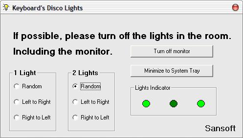



## Keyboard's Disco Lights \(Updated\)

### Description

This is the updated version of Keyboard's Disco Lights. The coding is better than the previous version. :)
 
### More Info
 
Must have a keyboard with LED. :)

             |
---                |---
**Submitted On**   |2002-11-25 23:48:12
**By**             |[A\.K\.San](https://github.com/Planet-Source-Code/PSCIndex/blob/master/ByAuthor/a-k-san.md)
**Level**          |Intermediate
**User Rating**    |4.5 (45 globes from 10 users)
**Compatibility**  |VB 4\.0 \(32\-bit\), VB 5\.0, VB 6\.0
**Category**       |[Windows API Call/ Explanation](https://github.com/Planet-Source-Code/PSCIndex/blob/master/ByCategory/windows-api-call-explanation__1-39.md)
**World**          |[Visual Basic](https://github.com/Planet-Source-Code/PSCIndex/blob/master/ByWorld/visual-basic.md)
**Archive File**   |[Keyboard's15041511272002\.zip](https://github.com/Planet-Source-Code/a-k-san-keyboard-s-disco-lights-updated__1-40415/archive/master.zip)

